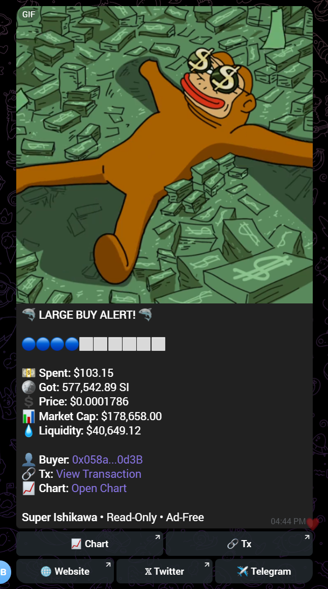

# 🚀 Custom BuyBot Development

Are you looking for a **custom BuyBot** for your token?

I can build a **fully automated BuyBot** that tracks token purchases, displays real-time trade data, and sends instant alerts to your Telegram community.

## 🔥 Features

- ⚡ **Real-Time Buy Alerts** – Instantly notifies your Telegram group of new token buys.
- 💰 **Trade Information** – Displays buy amount, token price, market cap, and more.
- 📊 **Customizable Alerts** – Customize messages, emojis, GIFs, and layouts.
- 🔗 **Transaction Links** – Direct blockchain explorer links.
- 🌐 **Multi-Chain Support** – Ethereum, BSC, Polygon, and other EVM-compatible networks.
- 🤖 **Telegram Integration** – Works directly with Telegram groups.
- 🎨 **Full Branding** – Custom bot name, logo, emojis, GIFs, and project links.
- ⚡ **Fast & Reliable** – Optimized for real-time transaction monitoring.

## 📌 Why Choose This BuyBot?

✅ **Automated** – No manual monitoring required.  
✅ **Real-Time** – Instant buy notifications.  
✅ **Customizable** – Designed around your project.  
✅ **Multi-Chain** – Supports EVM-compatible networks.  
✅ **Telegram Ready** – Perfect for Web3 communities.

## 🖼️ BuyBot Preview

## 🛠️ Use Cases

- 🪙 Token Projects
- 🚀 Meme Coins
- 💎 DeFi Projects
- 🌐 Web3 Communities
- 📈 Trading Communities
- 🤖 Telegram Crypto Groups

## 📩 Custom Development

Need a custom BuyBot with additional features?

Contact me on Telegram:

👉 **[@byshake](https://t.me/byshake)**

---

⭐ **If you find this project useful, consider giving it a star!**
